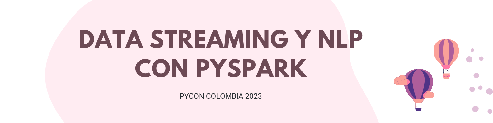

# Workshop - PyCon Colombia 2023

Este repositorio contiene el código para extraer información desde Reddit y realizar NLP al texto de los subreddits tomados.

Este contenido ha sido creado para un taller de Data Streaming y NLP con PySpark.

## Contenido

### Spark Structured Data Streaming

Este notebook implementa una simulación de spark structured streaming con pyspark de datos extraídos de la api de Reddit. Se realiza un proceso de lectura y escritura "en tiempo real".

  <h4>Ejecuta el código:</h4>
  

### NLP con PySpark

Este notebook en Google Colab te permitirá implementar NLP a la base almacenada en el notebook anterior. Podrás encontrar la lectura de la base utilizando PySpark, el preprocesamiento de texto, implementación de LDA para identificar temáticas en la conversación, wordcloud te temáticas, n-gramas y gráfica de temáticas utilizando la librería pyLDAvis.

  <h4>Ejecuta el código:</h4>
  

## Recursos Spark Structured Data Streaming
- <a href="http://bit.ly/460pvY7">Charla Data Streaming con PySpark </a>
- <a href="https://bit.ly/43wJts5">Introducción a PySpark </a>
- <a href="https://spark.apache.org/docs/latest/structured-streaming-programming-guide.html">Guía Structured Streaming</a>

## Recursos Procesamiento de Lenguaje Natural (NLP)
- <a href="https://huggingface.co/"> Hugging Face </a>
- <a href="https://pypi.org/project/gensim/"> Gensim </a>
- <a href="https://www.nltk.org/"> NLTK </a>

